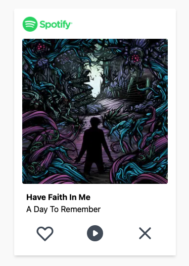
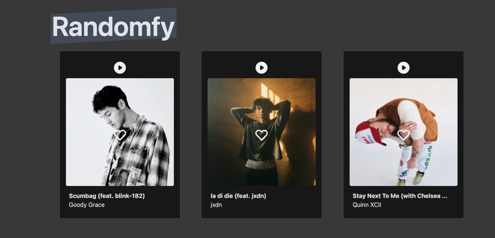

 

# randomfy

This is a project that will show artists and musics based in the recommendation from Spotify.
After the user logged in the application, recommendation will appear.
When user likes the recommendation, he can gives a like it simmilar the Tinder.

> disclaimer: I'll improve this readme soon

## About

Randomfy takes your most listened to Spotify artists and select one of them for you can know new artists based in this artist selected. If you liked that artist, you can give a like. After that, you can make a playlist with the artists liked and share with your friends. Also you can create a picture with this artists.

Disclaimer: Randomfy is not affiliated with Spotify. The site is built on Nextjs, React and the Spotify API.

## Todo

- [ ] refresh token

## Demo

[randomfy](https://random-fy.vercel.app/)

## Screenshots

- Light Mode
  

- Dark Mode
  

## Stack

**Front-end:**

- [NextJs](https://nextjs.org/docs)
- [React](https://pt-br.reactjs.org/docs/getting-started.html)
- [TailwindCSS](https://tailwindcss.com/docs/)
- [React-Query](https://react-query.tanstack.com/)
- [Axios](https://github.com/axios/axios)
- [React Testing Library](https://testing-library.com/docs/react-testing-library/intro/)
- [MSW JS](https://mswjs.io/)

**Back-end:**

- [NextJs](https://nextjs.org/docs)
- [Jest](https://jestjs.io/)

## References

- [Spotify Web Api](https://developer.spotify.com/documentation/web-api/reference)
- [Festify](https://salty-beach-42139.herokuapp.com/)
- [Receiptify](https://receiptify.herokuapp.com/)

## Author

- [@andraderaul](https://github.com/andraderaul)
