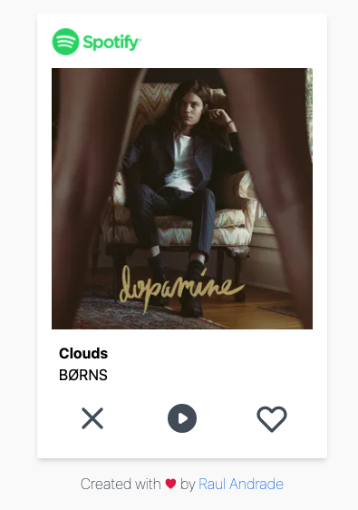

 

# randomfy

## About

Randomfy takes your most listened Spotify artists, selects one of them and shows you similar artists, so you can meet new artists based on the previous selected one.

Disclaimer: Randomfy is not affiliated with Spotify. The site was build with Nextjs, React and the Spotify API.

## How it works

This project shows artists and songs based on your Spotify recommendation. When the user signs in the application, a recommendation is shown. The user can like or dislike the recommendation, just like on Tinder. After that, you can make a playlist with the liked artists and share it with your friends. Also, you can create an image with these artists.

## Todo

- [ ] refresh token
- [ ] hide already liked songs

## Demo

[randomfy](https://random-fy.vercel.app/)

## Screenshots

- Light Mode
  

- Dark Mode
  

## Stack

**Front-end:**

- [NextJs](https://nextjs.org/docs)
- [React](https://pt-br.reactjs.org/docs/getting-started.html)
- [TailwindCSS](https://tailwindcss.com/docs/)
- [React-Query](https://react-query.tanstack.com/)
- [Axios](https://github.com/axios/axios)
- [React Testing Library](https://testing-library.com/docs/react-testing-library/intro/)
- [MSW JS](https://mswjs.io/)

**Back-end:**

- [NextJs](https://nextjs.org/docs)
- [Jest](https://jestjs.io/)

## Related projects

- [Festify](https://salty-beach-42139.herokuapp.com/)
- [Receiptify](https://receiptify.herokuapp.com/)

## References

- [Spotify Web Api](https://developer.spotify.com/documentation/web-api/reference)

## License

[MIT](./LICENSE)

## Author

- [@andraderaul](https://github.com/andraderaul)
