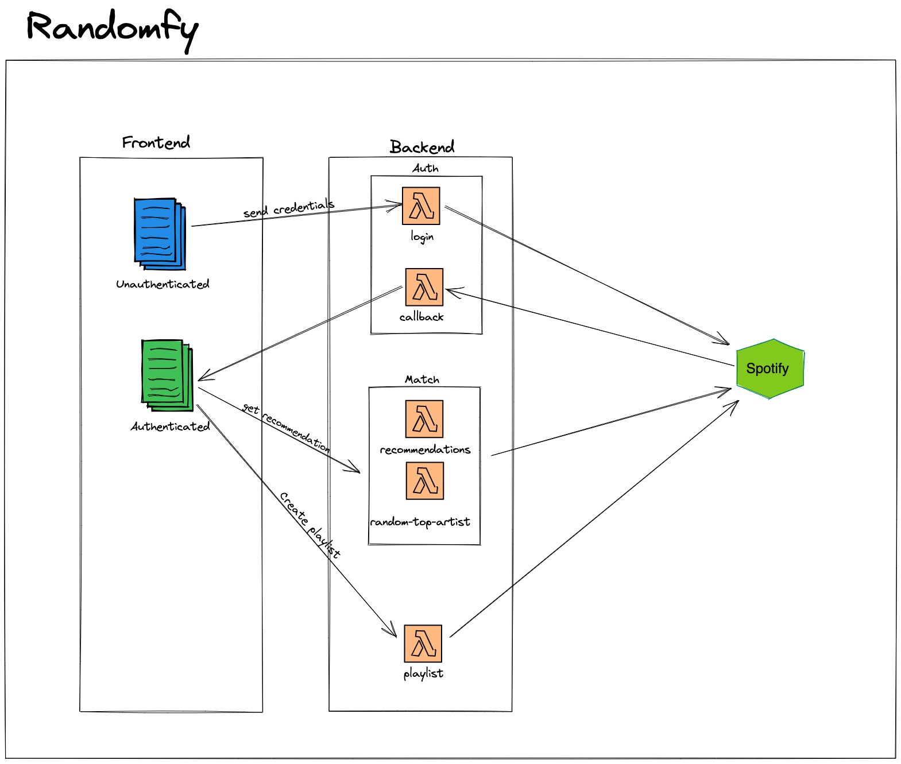

# Como funciona

Atualmente as recomendações funcionam da seguinte maneira, é selecionado um artista entre os 50 artistas mais ouvidos do Spotify do usuário logado e esse artista é usado para encontrar artistas similares a ele, para então o randomfy gerar uma recomendação.

As músicas são selecionadas a partir do top musicas mais ouvidas do artista do Spotify.

Quando um usuário acessa o aplicativo pela primeira vez será solicitado as credenciais dele do Spotify. Após o usuário fornecer as credenciais a autenticação é feita.

Com o usuário autenticado o `randomfy` escolhe aleatoriamente um artista para ser o seed das recomendações, ou seja, o artista escolhido de forma aleatoria não será o artista recomendado, mas sim os artistas relacionados a ele.

Quando o usuário da like em um artista o `randomfy` solicita ao Spotify artistas relacionados ao artista que recebeu o like e escolhe um para exibir ao usuário logado.

Ao final de 20 recomendações é possivel criar uma playlist com os artistas gostados.

# Arquitetura

O `randomfy` foi feito usando serverless functions e hospedado na vercel.

### Functions

- login: que cria a url de autorização do Spotify;

- callback: após a url de authorização ser criada e executada o Spotify envia os tokens de autenticação para a callback function;

- recommendations: retorna uma recomendação de música e artista para o usuário autenticado;

- random top artist: escolhe um artista entre os artistas mais ouvidos do usuário autenticado;

- playlist: cria uma playlist com os artistas que o usuário autenticado gostou;
